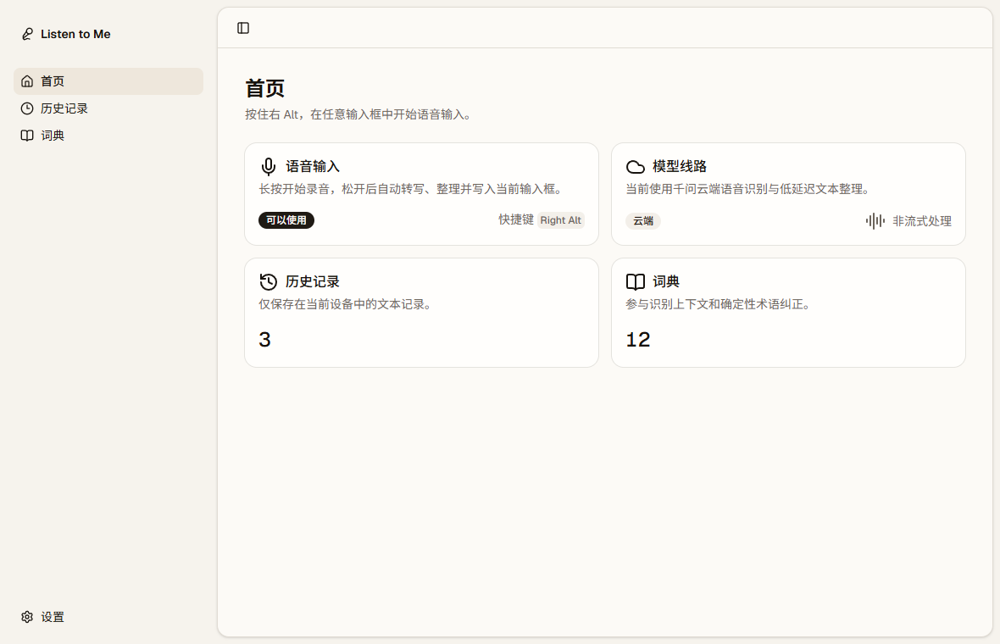
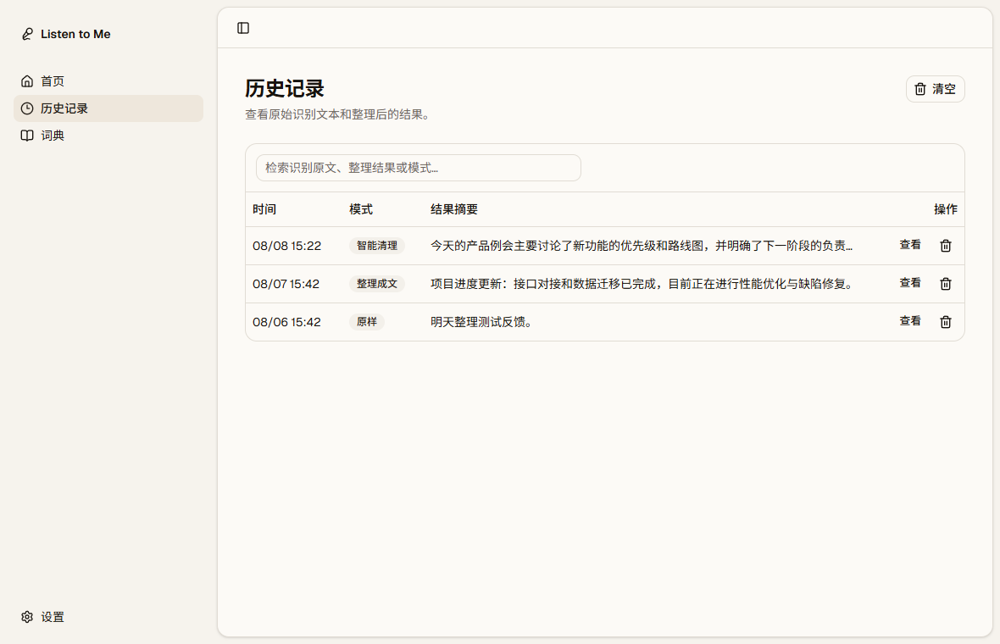
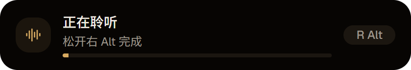

# Listen to Me

Listen to Me 是一款面向 Windows 的桌面语音输入工具：按住右 Alt 说话，松开后完成语音识别、文本整理，并将结果写入当前输入框。

> 当前版本：`0.1.0`。这是首个可运行的 P0 开发版本，仍需完成真实桌面应用兼容性测试后再用于日常工作。

## 功能

- 全局右 Alt 按住说话，短按不会触发录音
- 录音、识别、整理、写入的悬浮状态提示
- 原样转写、智能清理、整理成文、结构化四种模式
- 本地历史记录、搜索、复制和删除
- 个人词典与确定性术语纠正
- 千问语音识别和文本整理，API Key 保存到 Windows 凭据管理器
- 系统托盘、单实例运行和开机启动
- Escape 取消当前语音会话

## 当前界面

以下截图来自 `0.1.0` 当前代码的实际渲染结果。历史记录截图使用演示数据，不包含真实用户内容。







## 技术栈

- Tauri 2 + Rust
- React 19 + TypeScript + Vite
- Tailwind CSS 4 + Base UI / shadcn
- SQLite、本机音频采集与 Windows 原生输入注入

## 本地开发

### 环境要求

- Windows 10/11
- Node.js 与 pnpm
- Rust stable 与 Tauri 2 的 Windows 构建依赖
- 可用的千问 DashScope API Key（仅在运行时配置，不要写入仓库）

### 启动

```powershell
pnpm install
pnpm tauri dev
```

仅启动前端界面：

```powershell
pnpm dev
```

### 构建

```powershell
pnpm build
pnpm tauri build
```

开发调试版可执行文件也可以这样生成：

```powershell
pnpm tauri build --debug --no-bundle
```

## 使用方式

1. 在“设置 → 模型与网络”中保存千问 API Key。
2. 将光标放在任意普通文本输入框中。
3. 按住右 Alt 至悬浮窗出现，然后开始说话。
4. 松开右 Alt，等待识别、整理和自动写入。
5. 处理中可按 Escape 取消。

## 隐私与安全

- API Key 由 Windows 凭据管理器保存，前端不会读取或展示原值。
- 音频在内存中处理，不会作为原始音频文件持久化。
- 历史记录保存在本机，可在设置中关闭或在历史页面清空。
- `.env`、构建产物和本地缓存已排除在版本控制之外。

## 文档

- [架构说明](docs/architecture.md)
- [实现计划](docs/implementation-plan.md)
- [Windows 手动测试清单](docs/manual-test-windows.md)
- [语音输入市场与架构调研](docs/voice-input-market-and-architecture-research.md)

## 已知限制

- 当前仅支持 Windows。
- 右 Alt 在应用运行期间会被占用，AltGr 键盘布局仍需专项验证。
- 直接 Unicode 输入无法写入更高权限运行的应用。
- 本地离线模型尚未实现。

## License

暂未指定开源许可证。
